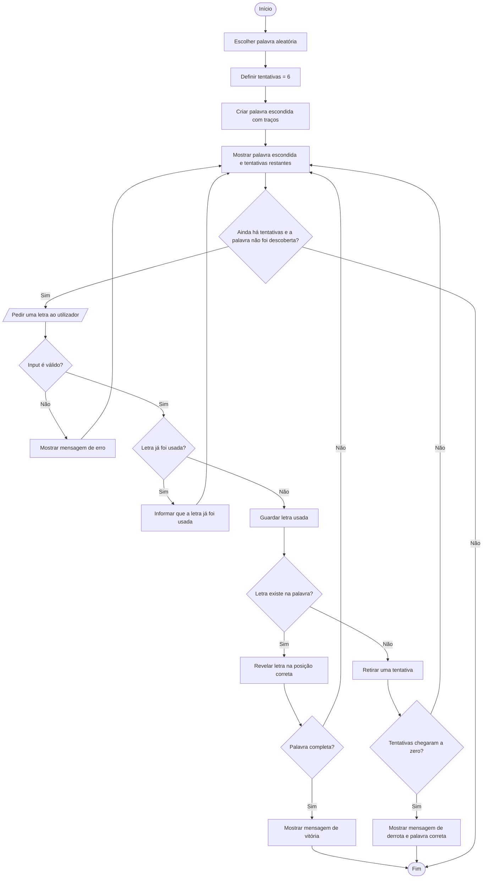

# Jogo da Forca

## 5.1 Definição do problema

Este projeto consiste em criar um jogo da forca em Python.

O objetivo é permitir que o utilizador tente adivinhar uma palavra escondida, introduzindo uma letra de cada vez. A palavra será apresentada com traços e, sempre que o utilizador acertar numa letra, essa letra será mostrada na posição correta.

## Objetivo do jogo

O objetivo do jogo é descobrir a palavra completa antes de terminar o número máximo de tentativas.

## Regras principais

- O utilizador só pode introduzir uma letra de cada vez.
- Se a letra existir na palavra, será apresentada no local correto.
- Se a letra não existir, o utilizador perde uma tentativa.
- Letras repetidas não contam como nova tentativa.
- Não são aceites números, símbolos ou respostas vazias.
- A palavra será escolhida automaticamente pelo programa com base num conjunto de palavras pré-definidas.

## Vitória e derrota

O jogador ganha se conseguir descobrir a palavra antes de esgotar as tentativas.

O jogador perde se atingir o limite máximo de tentativas sem descobrir a palavra.

## Limitações

- O jogo será feito em Python.
- O jogo será executado no terminal.
- Não terá interface gráfica.
- O número máximo de erros será de 6 tentativas.
- As palavras estarão guardadas numa lista simples dentro do programa.

## Resumo

Criar um programa em Python que permita ao utilizador jogar à forca, tentando descobrir uma palavra escondida através da introdução de letras, respeitando um limite máximo de tentativas.

---

## 5.2 Recolha de requisitos

Nesta fase foram definidos os requisitos do jogo da forca. Os requisitos funcionais indicam o que o programa deve fazer. Os requisitos não funcionais indicam como o programa deve funcionar.

## Requisitos funcionais

1. O programa deve escolher automaticamente uma palavra a partir de uma lista pré-definida.

2. O programa deve apresentar a palavra escondida através de traços, sem mostrar as letras no início do jogo.

3. O utilizador deve conseguir introduzir uma letra de cada vez.

4. O programa deve verificar se a letra introduzida existe ou não na palavra escondida.

5. Quando a letra estiver correta, o programa deve mostrar essa letra na posição certa.

6. Quando a letra estiver errada, o programa deve retirar uma tentativa ao jogador e mostrar quantas tentativas ainda restam.

## Requisitos não funcionais

1. O programa deve ser simples e fácil de utilizar.

2. O programa deve apresentar mensagens claras para orientar o utilizador durante o jogo.

3. O programa deve ser executado no terminal, sem necessidade de interface gráfica.

---

## 5.3 Fluxograma — Jogo da Forca

Nesta fase foi criado o fluxograma do jogo da forca, representando o funcionamento principal do algoritmo antes da programação.

O fluxograma inclui o início do jogo, a escolha da palavra, o ciclo principal, a validação do input, as decisões sobre letras corretas ou erradas, as condições de vitória e derrota, e o fim do jogo.



---

## 5.4 Estrutura do projeto

Nesta fase foi criada a estrutura inicial do projeto, de forma a organizar melhor os ficheiros.

A estrutura definida foi a seguinte:

```text
5_1_jogo_da_forca/
│
├── README.md
└── forca/
    ├── main.py
    └── jogo.py
```

O ficheiro `main.py` é usado como ponto de entrada do programa.

O ficheiro `jogo.py` contém a lógica principal do jogo da forca.

Esta organização permite separar melhor o código, evitar ficheiros demasiado grandes e manter nomes claros.

---

## 5.5 Implementação

Nesta fase foi implementado o núcleo funcional do jogo da forca.

O programa permite escolher uma palavra aleatória, apresentar a palavra escondida com traços, receber letras introduzidas pelo utilizador, validar o input, controlar letras repetidas, atualizar as tentativas e apresentar o resultado final de vitória ou derrota.

A implementação foi organizada em dois ficheiros principais:

- `main.py`: ficheiro principal usado para iniciar o jogo.
- `jogo.py`: ficheiro onde está a lógica principal do jogo.

O código foi separado em funções para tornar o programa mais simples de ler, testar e manter.

---

## 5.6 Testes

Nesta fase foram definidos testes para validar o funcionamento do jogo da forca.

O objetivo dos testes é confirmar se o programa responde corretamente a entradas válidas e inválidas, garantindo maior robustez e evitando erros durante a utilização.

## Casos de teste válidos

| Nº | Entrada | Resultado esperado | Resultado obtido |
|---|---|---|---|
| 1 | `a` | O programa aceita a letra e verifica se existe na palavra. | Conforme esperado |
| 2 | `p` | O programa aceita a letra e atualiza a palavra ou as tentativas. | Conforme esperado |
| 3 | `o` | O programa aceita a letra e continua o jogo. | Conforme esperado |
| 4 | `t` | O programa aceita a letra e verifica se está correta. | Conforme esperado |
| 5 | `m` | O programa aceita a letra e mantém o ciclo do jogo. | Conforme esperado |

## Casos de teste inválidos

| Nº | Entrada | Resultado esperado | Resultado obtido |
|---|---|---|---|
| 1 | `1` | O programa deve apresentar erro por não aceitar números. | Conforme esperado |
| 2 | `@` | O programa deve apresentar erro por não aceitar símbolos. | Conforme esperado |
| 3 | `ab` | O programa deve apresentar erro por ter mais de uma letra. | Conforme esperado |
| 4 | `""` campo vazio | O programa deve apresentar erro por não receber uma letra. | Conforme esperado |
| 5 | letra repetida | O programa deve informar que a letra já foi usada. | Conforme esperado |

## Tratamento de erros

Foi implementado tratamento de erros com `try/except` na validação da letra introduzida pelo utilizador.

Desta forma, o programa consegue identificar entradas inválidas, apresentar uma mensagem clara e continuar a execução sem terminar de forma inesperada.

---

## 5.7 Documentação

Nesta fase foi completada a documentação do projeto, para que outro utilizador consiga perceber o objetivo do jogo, as regras principais e a forma correta de executar o programa.

## Descrição do jogo

O Jogo da Forca é um jogo simples em Python, executado no terminal, onde o utilizador tenta adivinhar uma palavra escondida.

A palavra é escolhida automaticamente pelo programa a partir de uma lista pré-definida. O jogador introduz uma letra de cada vez e o programa indica se essa letra existe ou não na palavra.

O objetivo é descobrir a palavra completa antes de esgotar o número máximo de tentativas.

## Regras do jogo

- O jogador deve introduzir apenas uma letra de cada vez.
- Não são aceites números, símbolos ou respostas vazias.
- Se a letra existir na palavra, será apresentada na posição correta.
- Se a letra não existir, o jogador perde uma tentativa.
- Letras repetidas não contam como nova tentativa.
- O jogador tem 6 tentativas para tentar descobrir a palavra.
- O jogo termina quando o jogador descobre a palavra ou quando esgota as tentativas.

## Requisitos para executar

Para executar o jogo é necessário ter Python instalado no computador.

O projeto está organizado da seguinte forma:

```text
5_1_jogo_da_forca/
│
├── README.md
└── forca/
    ├── main.py
    └── jogo.py
```

## Instruções de execução

Para executar o jogo, abrir o terminal na pasta principal do projeto e entrar na pasta `forca`:

```bash
cd forca
```

Depois executar o ficheiro principal:

```bash
python main.py
```

Caso o comando anterior não funcione, pode ser usado:

```bash
py main.py
```

## Exemplo de utilização

Ao executar o jogo, será apresentada uma palavra escondida com traços:

```text
=== Jogo da Forca ===
Bem-vindo ao jogo.
Tenta descobrir a palavra escondida.
Tens 6 tentativas.

Palavra: _ _ _ _ _ _
Tentativas restantes: 6
Letras usadas: nenhuma
Introduz uma letra:
```

Exemplo de uma jogada válida:

```text
Introduz uma letra: a
Boa! A letra existe na palavra.
```

Exemplo de uma jogada inválida:

```text
Introduz uma letra: 1
Erro: Não são aceites números ou símbolos.
```

Exemplo de derrota:

```text
Perdeste! A palavra era: python
```

Exemplo de vitória:

```text
Parabéns! Conseguiste descobrir a palavra: python
```

## Conclusão

Com esta documentação, o projeto fica mais claro para outros utilizadores, permitindo perceber o funcionamento do jogo, as regras aplicadas e a forma correta de executar o programa.

## Vídeo de apresentação

Foi criado um vídeo de apresentação do projeto, onde é demonstrado o funcionamento do jogo da forca no terminal.

O vídeo apresenta a execução do jogo, a introdução de letras, a validação das respostas e o resultado final.